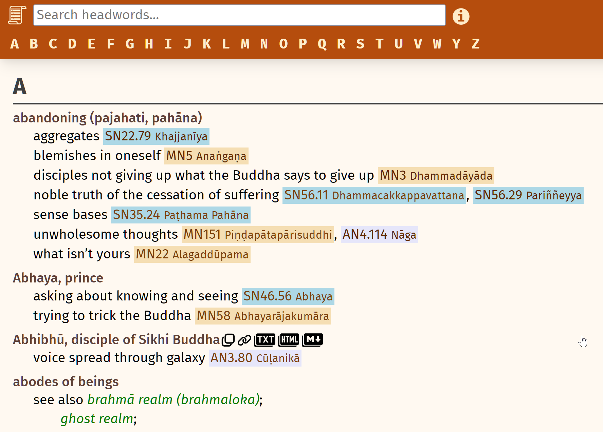

# Sutta Index Project

This sutta index is still very much a work in progress. You can find a demo of the data [here](https://index.readingfaithfully.org/).

If you would like to offer feedback, please see [this page in the documentation](https://github.com/thesunshade/CIPS/blob/main/src/documentation/helpfulFeedback.md#offering-feedback).

Curious about the philosopy being used to create the index? See [these notes](https://github.com/thesunshade/CIPS/blob/main/src/documentation/principlesOfIndexingSuttas.md#principles-of-indexing-suttas).

## Running locally

To run the site locally, just start a simple http server pointing at the "public" folder:

```bash
npx http-server public -o -p 9999
```

## Development

The site is built by running

```
node build
```

in the root directory. This will generate the single `public/index.html` file as well as bundle all of the scripts files into `public/index.js` and the css into `public/index.css`
